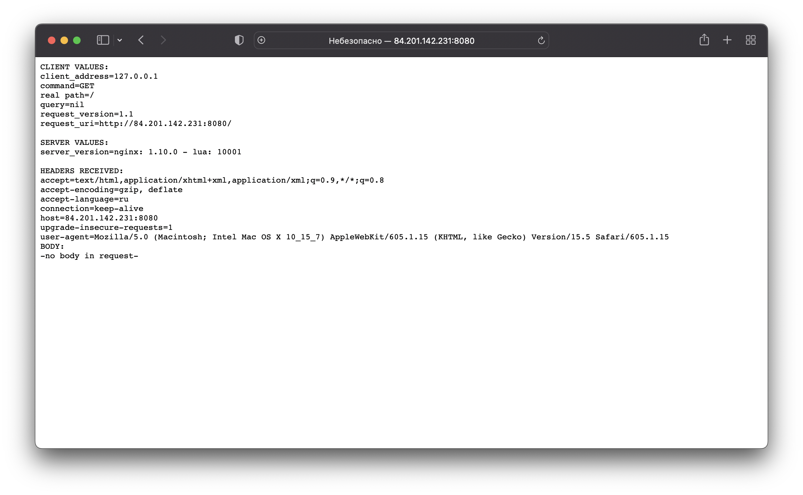

# 12.1 Компоненты Kubernetes  

## Задача 1: Установить Minikube  

Версия minikube:  
```bash
~ % minikube version
minikube version: v1.25.2
commit: 362d5fdc0a3dbee389b3d3f1034e8023e72bd3a7
```
Запуск:  
```bash
~ % minikube start --driver=docker
😄  minikube v1.25.2 на Darwin 12.4 (arm64)
✨  Используется драйвер docker на основе конфига пользователя
👍  Запускается control plane узел minikube в кластере minikube
🚜  Скачивается базовый образ ...
🔥  Creating docker container (CPUs=2, Memory=3885MB) ...
🐳  Подготавливается Kubernetes v1.23.3 на Docker 20.10.12 ...
    ▪ kubelet.housekeeping-interval=5m
    ▪ Generating certificates and keys ...
    ▪ Booting up control plane ...
    ▪ Configuring RBAC rules ...
🔎  Компоненты Kubernetes проверяются ...
    ▪ Используется образ gcr.io/k8s-minikube/storage-provisioner:v5
🌟  Включенные дополнения: storage-provisioner, default-storageclass
🏄  Готово! kubectl настроен для использования кластера "minikube" и "default" пространства имён по умолчанию
```
Статус:  
```bash
~ % minikube status
minikube
type: Control Plane
host: Running
kubelet: Running
apiserver: Running
kubeconfig: Configured
```
Запущенные служебные компоненты:  
```bash
~ % kubectl get pods --namespace=kube-system 
NAME                               READY   STATUS    RESTARTS        AGE
coredns-64897985d-6lx2v            1/1     Running   0               6m2s
etcd-minikube                      1/1     Running   0               6m15s
kube-apiserver-minikube            1/1     Running   0               6m17s
kube-controller-manager-minikube   1/1     Running   0               6m15s
kube-proxy-6669g                   1/1     Running   0               6m2s
kube-scheduler-minikube            1/1     Running   0               6m17s
storage-provisioner                1/1     Running   1 (5m32s ago)   6m14s
```

## Задача 2: Запуск Hello World  

Создаем деплоймент:  
```bash
~ % kubectl create deployment hello-node --image=k8s.gcr.io/echoserver:1.4
deployment.apps/hello-node created

~ % kubectl get deployments.apps hello-node 
NAME         READY   UP-TO-DATE   AVAILABLE   AGE
hello-node   1/1     1            1           57m

~ % kubectl get pods
NAME                          READY   STATUS    RESTARTS   AGE
hello-node-6b89d599b9-m9k6d   1/1     Running   0          60m
```
Создаем сервис:  
```bash
~ % kubectl expose deployment hello-node --type=LoadBalancer --port=8080
service/hello-node exposed

~ % kubectl get services
NAME         TYPE           CLUSTER-IP       EXTERNAL-IP   PORT(S)          AGE
hello-node   LoadBalancer   10.109.237.153   <pending>     8080:32084/TCP   53m
kubernetes   ClusterIP      10.96.0.1        <none>        443/TCP          62m
```
Установка аддона ingress:  
```bash
~ % minikube addons enable ingress
💡  After the addon is enabled, please run "minikube tunnel" and your ingress resources would be available at "127.0.0.1"
    ▪ Используется образ k8s.gcr.io/ingress-nginx/kube-webhook-certgen:v1.1.1
    ▪ Используется образ k8s.gcr.io/ingress-nginx/controller:v1.1.1
    ▪ Используется образ k8s.gcr.io/ingress-nginx/kube-webhook-certgen:v1.1.1
🔎  Verifying ingress addon...
🌟  The 'ingress' addon is enabled

~ % minikube addons list          
|-----------------------------|----------|--------------|--------------------------------|
|         ADDON NAME          | PROFILE  |    STATUS    |           MAINTAINER           |
|-----------------------------|----------|--------------|--------------------------------|
| ambassador                  | minikube | disabled     | third-party (ambassador)       |
| auto-pause                  | minikube | disabled     | google                         |
| csi-hostpath-driver         | minikube | disabled     | kubernetes                     |
| dashboard                   | minikube | enabled ✅   | kubernetes                     |
| default-storageclass        | minikube | enabled ✅   | kubernetes                     |
| efk                         | minikube | disabled     | third-party (elastic)          |
| freshpod                    | minikube | disabled     | google                         |
| gcp-auth                    | minikube | disabled     | google                         |
| gvisor                      | minikube | disabled     | google                         |
| helm-tiller                 | minikube | disabled     | third-party (helm)             |
| ingress                     | minikube | enabled ✅   | unknown (third-party)          |
| ingress-dns                 | minikube | disabled     | google                         |
| istio                       | minikube | disabled     | third-party (istio)            |
| istio-provisioner           | minikube | disabled     | third-party (istio)            |
| kong                        | minikube | disabled     | third-party (Kong HQ)          |
| kubevirt                    | minikube | disabled     | third-party (kubevirt)         |
| logviewer                   | minikube | disabled     | unknown (third-party)          |
| metallb                     | minikube | disabled     | third-party (metallb)          |
| metrics-server              | minikube | disabled     | kubernetes                     |
| nvidia-driver-installer     | minikube | disabled     | google                         |
| nvidia-gpu-device-plugin    | minikube | disabled     | third-party (nvidia)           |
| olm                         | minikube | disabled     | third-party (operator          |
|                             |          |              | framework)                     |
| pod-security-policy         | minikube | disabled     | unknown (third-party)          |
| portainer                   | minikube | disabled     | portainer.io                   |
| registry                    | minikube | disabled     | google                         |
| registry-aliases            | minikube | disabled     | unknown (third-party)          |
| registry-creds              | minikube | disabled     | third-party (upmc enterprises) |
| storage-provisioner         | minikube | enabled ✅   | google                         |
| storage-provisioner-gluster | minikube | disabled     | unknown (third-party)          |
| volumesnapshots             | minikube | disabled     | kubernetes                     |
|-----------------------------|----------|--------------|--------------------------------|
```

## Задача 3: Установить kubectl  

Port-forward до кластера:  
```bash
~ % kubectl port-forward --address 0.0.0.0 services/hello-node 8080
Forwarding from 0.0.0.0:8080 -> 8080
```
