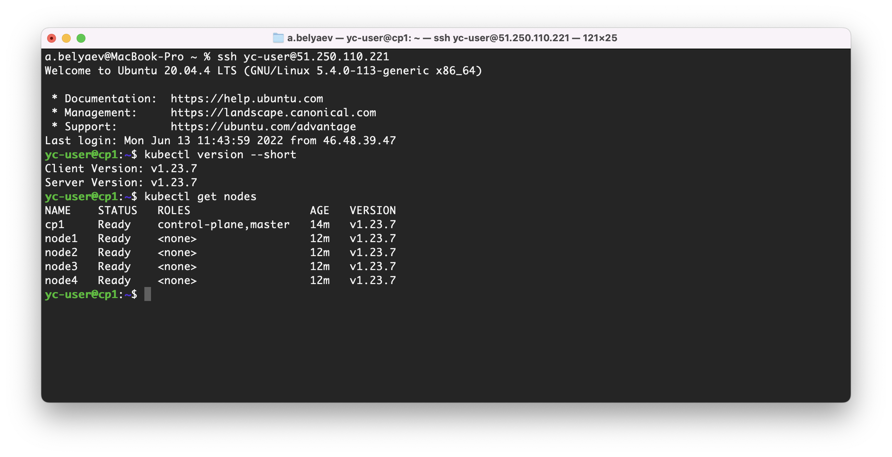
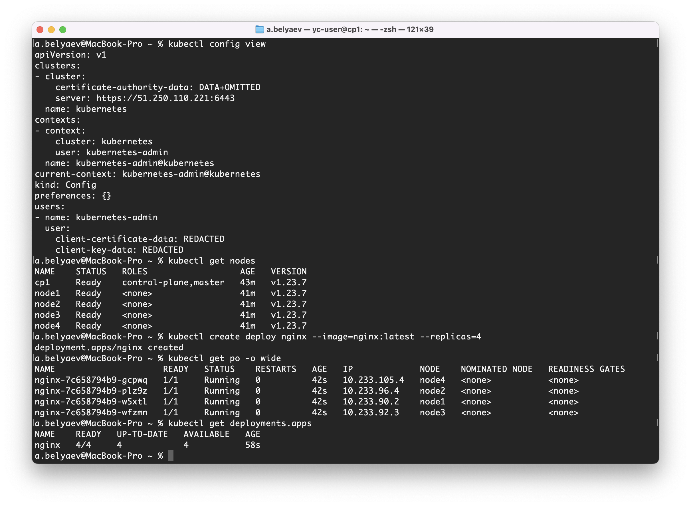

# 12.4 Развертывание кластера на собственных серверах, лекция 2  

## Задание 1: Подготовить инвентарь kubespray  

Новые тестовые кластеры требуют типичных простых настроек. Нужно подготовить инвентарь и проверить его работу. Требования к инвентарю:  

* подготовка работы кластера из 5 нод: 1 мастер и 4 рабочие ноды;
* в качестве CRI — containerd;
* запуск etcd производить на мастере.  

Подготовим ноды для кластера в Yandex Cloud.  
```shell
% yc compute instance list
+----------------------+-----------+---------------+---------+----------------+---------------+
|          ID          |   NAME    |    ZONE ID    | STATUS  |  EXTERNAL IP   |  INTERNAL IP  |
+----------------------+-----------+---------------+---------+----------------+---------------+
| epd2ka8micogtedg6od7 | cp1       | ru-central1-b | RUNNING | 51.250.110.221 | 192.168.99.28 |
| epd6lvj2o85h95qme5os | node2     | ru-central1-b | RUNNING | 84.252.143.177 | 192.168.99.15 |
| epdasikuldnt8ajd3asv | node3     | ru-central1-b | RUNNING | 84.201.139.90  | 192.168.99.17 |
| epdqhhnc92kh0qodlas5 | node4     | ru-central1-b | RUNNING | 51.250.29.222  | 192.168.99.14 |
| epdui06mu6eqm6vnqu2k | node1     | ru-central1-b | RUNNING | 84.201.160.128 | 192.168.99.9  |
+----------------------+-----------+---------------+---------+----------------+---------------+
```
Склонируем себе репозиторий kubespray `git clone https://github.com/kubernetes-sigs/kubespray`, и далее по инструкции.  
В итоге, подготовим файл `inventory/mycluster/hosts.yaml` следующего содержания:  
```yaml
all:
  hosts:
    cp1:
      ansible_host: 51.250.110.221
    node1:
      ansible_host: 84.201.160.128
    node2:
      ansible_host: 84.252.143.177
    node3:
      ansible_host: 84.201.139.90
    node4:
      ansible_host: 51.250.29.222
  children:
    kube_control_plane:
      hosts:
        cp1:
    kube_node:
      hosts:
        node1:
        node2:
        node3:
        node4:
    etcd:
      hosts:
        cp1:
    k8s_cluster:
      children:
        kube_control_plane:
        kube_node:
    calico_rr:
      hosts: {}
  vars:
    ansible_user: yc-user
```
Так же изменим файл `inventory/mycluster/group_vars/k8s_cluster/k8s-cluster.yml` следующими значениями:  
```yaml
supplementary_addresses_in_ssl_keys: [51.250.110.221] # Для удаленного доступа с рабочего компа, пропишем внешний IP контрол ноды.
container_manager: containerd                         # Выбор CRI. Был по умолчанию.
```
Запустим плейбук:  
```shell
% ansible-playbook -i inventory/mycluster/hosts.yaml  --become cluster.yml
...
...
PLAY RECAP *****************************************************************************************************************************************************************
cp1                        : ok=753  changed=146  unreachable=0    failed=0    skipped=1318 rescued=0    ignored=9   
localhost                  : ok=3    changed=0    unreachable=0    failed=0    skipped=0    rescued=0    ignored=0   
node1                      : ok=503  changed=95   unreachable=0    failed=0    skipped=792  rescued=0    ignored=2   
node2                      : ok=503  changed=95   unreachable=0    failed=0    skipped=791  rescued=0    ignored=2   
node3                      : ok=503  changed=95   unreachable=0    failed=0    skipped=791  rescued=0    ignored=2   
node4                      : ok=503  changed=95   unreachable=0    failed=0    skipped=791  rescued=0    ignored=2   

Monday 13 June 2022  16:36:27 +0500 (0:00:00.095)       0:23:14.051 *********** 
=============================================================================== 
download : download_container | Download image if required --------------------------------------------------------------------------------------------------------- 62.72s
download : download_container | Download image if required --------------------------------------------------------------------------------------------------------- 47.15s
kubernetes/control-plane : kubeadm | Initialize first master ------------------------------------------------------------------------------------------------------- 44.26s
network_plugin/calico : Wait for calico kubeconfig to be created --------------------------------------------------------------------------------------------------- 43.23s
kubernetes/preinstall : Install packages requirements -------------------------------------------------------------------------------------------------------------- 42.97s
download : download_container | Download image if required --------------------------------------------------------------------------------------------------------- 38.51s
download : download_container | Download image if required --------------------------------------------------------------------------------------------------------- 32.22s
download : download_container | Download image if required --------------------------------------------------------------------------------------------------------- 27.80s
kubernetes/kubeadm : Join to cluster ------------------------------------------------------------------------------------------------------------------------------- 27.80s
bootstrap-os : Install dbus for the hostname module ---------------------------------------------------------------------------------------------------------------- 26.12s
download : download_file | Validate mirrors ------------------------------------------------------------------------------------------------------------------------ 26.08s
download : download_container | Download image if required --------------------------------------------------------------------------------------------------------- 24.27s
kubernetes-apps/ansible : Kubernetes Apps | Lay Down CoreDNS templates --------------------------------------------------------------------------------------------- 23.53s
kubernetes-apps/ansible : Kubernetes Apps | Start Resources -------------------------------------------------------------------------------------------------------- 22.45s
download : download_container | Download image if required --------------------------------------------------------------------------------------------------------- 22.27s
download : download_container | Download image if required --------------------------------------------------------------------------------------------------------- 15.21s
kubernetes/preinstall : Update package management cache (APT) ------------------------------------------------------------------------------------------------------ 14.88s
network_plugin/calico : Calico | Create calico manifests ----------------------------------------------------------------------------------------------------------- 14.13s
download : download_container | Download image if required --------------------------------------------------------------------------------------------------------- 13.09s
network_plugin/calico : Start Calico resources --------------------------------------------------------------------------------------------------------------------- 11.27s
```
Проверим на контрол ноде:  

Проверим удаленное подключение с локального компьютера, предварительно скопировав ключи и поменяв адрес кластера в локальном config:  

