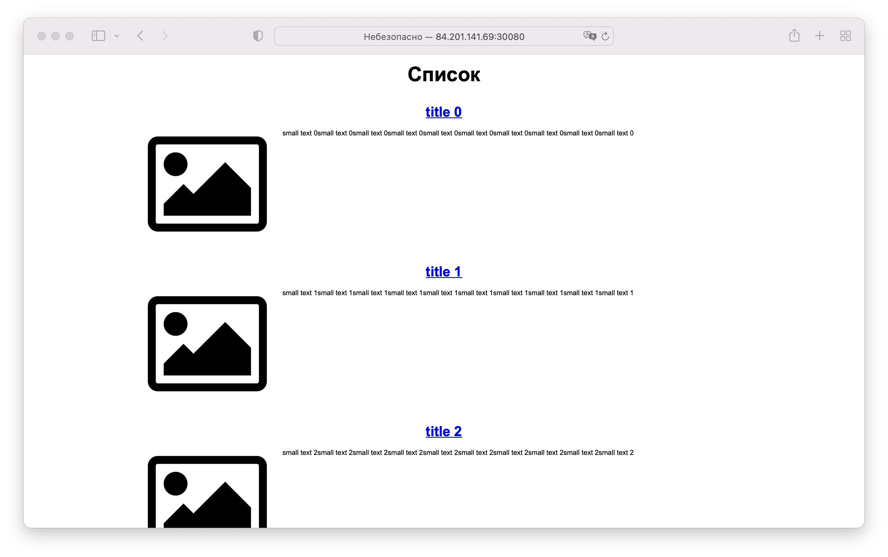
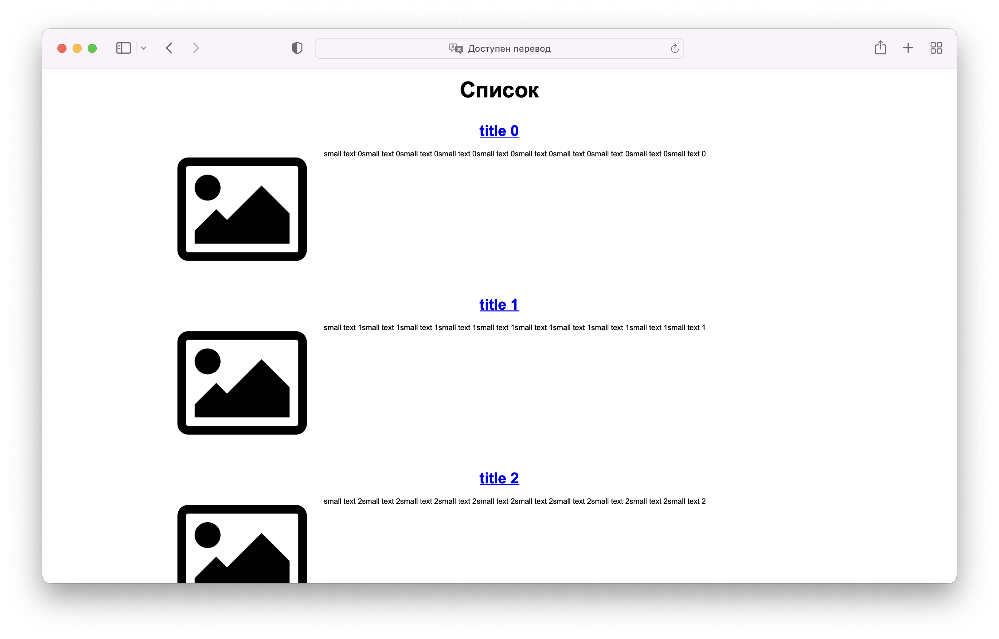

# 13.1 контейнеры, поды, deployment, statefulset, services, endpoints  

## Задание 1: подготовить тестовый конфиг для запуска приложения  

Для начала следует подготовить запуск приложения в stage окружении с простыми настройками. Требования:

* под содержит в себе 2 контейнера — фронтенд, бекенд;
* регулируется с помощью deployment фронтенд и бекенд;
* база данных — через statefulset.  

Деплоймент фронтенда, который содержит два контейнера. Публикуем в сервисе два порта и для фронтэнда и для бекэнда, чтобы
приложение было доступно снаружи кластера, [frontend.yaml](manifests/stage/frontend.yaml):  
```yaml
apiVersion: apps/v1
kind: Deployment
metadata:
  labels:
    app: frontend
  name: frontend
  namespace: stage
spec:
  replicas: 1
  selector:
    matchLabels:
      app: frontend
  template:
    metadata:
      labels:
        app: frontend
    spec:
      containers:
        - image: belas80/frontend
          imagePullPolicy: IfNotPresent
          name: frontend
          ports:
            - containerPort: 80
        - image: belas80/backend
          imagePullPolicy: IfNotPresent
          name: backend
          ports:
            - containerPort: 9000
      terminationGracePeriodSeconds: 30

---
apiVersion: v1
kind: Service
metadata:
  name: frontend
  namespace: stage
spec:
  ports:
    - name: web8000
      port: 8000
      targetPort: 80
      nodePort: 30080
    - name: web9000
      port: 9000
      nodePort: 30081
  selector:
    app: frontend
  type: NodePort
```
StatefulSet базы данных, [db.yaml](manifests/stage/db.yaml):  
```yaml
apiVersion: apps/v1
kind: StatefulSet
metadata:
  labels:
    app: db
  name: db
  namespace: stage
spec:
  serviceName: "db"
  replicas: 1
  selector:
    matchLabels:
      app: db
  template:
    metadata:
      labels:
        app: db
    spec:
      containers:
        - image: postgres:13-alpine
          imagePullPolicy: IfNotPresent
          name: db
          ports:
            - containerPort: 5432
          env:
            - name: POSTGRES_PASSWORD
              value: postgres
            - name: POSTGRES_USER
              value: postgres
            - name: POSTGRES_DB
              value: news
      terminationGracePeriodSeconds: 30

---
apiVersion: v1
kind: Service
metadata:
  name: db
  namespace: stage
spec:
  ports:
    - name: pgport
      port: 5432
  selector:
    app: db
```
Применим манифесты:  
```shell
a.belyaev@MacBook-Pro-2 manifests % kubectl apply -f stage          
statefulset.apps/db created
service/db created
deployment.apps/frontend created
service/frontend created
```
И проверяем:  
```shell
a.belyaev@MacBook-Pro-2 manifests % kubectl get deploy,sts,svc,po -o wide                                               
NAME                        READY   UP-TO-DATE   AVAILABLE   AGE     CONTAINERS          IMAGES                                  SELECTOR
deployment.apps/frontend    1/1     1            1           7m42s   frontend,backend    belas80/frontend,belas80/backend        app=frontend
deployment.apps/multitool   1/1     1            1           28m     network-multitool   praqma/network-multitool:alpine-extra   app=multitool

NAME                  READY   AGE     CONTAINERS   IMAGES
statefulset.apps/db   1/1     7m43s   db           postgres:13-alpine

NAME                TYPE        CLUSTER-IP     EXTERNAL-IP   PORT(S)                         AGE     SELECTOR
service/db          ClusterIP   10.233.54.36   <none>        5432/TCP                        7m42s   app=db
service/frontend    NodePort    10.233.49.9    <none>        8000:30080/TCP,9000:30081/TCP   7m42s   app=frontend
service/multitool   ClusterIP   10.233.9.197   <none>        80/TCP                          28m     app=multitool

NAME                             READY   STATUS    RESTARTS   AGE     IP             NODE    NOMINATED NODE   READINESS GATES
pod/db-0                         1/1     Running   0          7m42s   10.233.96.28   node2   <none>           <none>
pod/frontend-5d9fdbf6d5-vns2z    2/2     Running   0          101s    10.233.96.29   node2   <none>           <none>
pod/multitool-55974d5464-qs8pk   1/1     Running   0          28m     10.233.90.28   node1   <none>           <none>
```
Внутри контейнеры `frontend` и `backend` видят себя по `localhost`:  
```shell
a.belyaev@MacBook-Pro-2 manifests % kubectl exec pods/frontend-5d9fdbf6d5-vns2z -c frontend -i -t -- curl localhost:9000
{"detail":"Not Found"}%                                                                                                                                                     
a.belyaev@MacBook-Pro-2 manifests % kubectl exec pods/frontend-5d9fdbf6d5-vns2z -c backend -i -t -- curl localhost:80   
<!DOCTYPE html>
<html lang="ru">
<head>
    <title>Список</title>
    <meta charset="UTF-8">
    <meta name="viewport" content="width=device-width, initial-scale=1.0">
    <link href="/build/main.css" rel="stylesheet">
</head>
<body>
    <main class="b-page">
        <h1 class="b-page__title">Список</h1>
        <div class="b-page__content b-items js-list"></div>
    </main>
    <script src="/build/main.js"></script>
</body>
</html>% 
```
База данных доступна по имени сервиса `db`:  
```shell
a.belyaev@MacBook-Pro-2 manifests % kubectl exec pods/frontend-5d9fdbf6d5-vns2z -c backend -i -t -- ping -c 1 db     
PING db.stage.svc.cluster.local (10.233.54.36) 56(84) bytes of data.
64 bytes from db.stage.svc.cluster.local (10.233.54.36): icmp_seq=1 ttl=64 time=0.045 ms

--- db.stage.svc.cluster.local ping statistics ---
1 packets transmitted, 1 received, 0% packet loss, time 0ms
rtt min/avg/max/mdev = 0.045/0.045/0.045/0.000 ms
```
Проверим бд с помощью мультитул:  
```shell
a.belyaev@MacBook-Pro-2 manifests % kubectl exec svc/multitool -i -t -- psql -U postgres -W -h db -c '\l'                        
Password: 
                                 List of databases
   Name    |  Owner   | Encoding |  Collate   |   Ctype    |   Access privileges   
-----------+----------+----------+------------+------------+-----------------------
 news      | postgres | UTF8     | en_US.utf8 | en_US.utf8 | 
 postgres  | postgres | UTF8     | en_US.utf8 | en_US.utf8 | 
 template0 | postgres | UTF8     | en_US.utf8 | en_US.utf8 | =c/postgres          +
           |          |          |            |            | postgres=CTc/postgres
 template1 | postgres | UTF8     | en_US.utf8 | en_US.utf8 | =c/postgres          +
           |          |          |            |            | postgres=CTc/postgres
(4 rows)

a.belyaev@MacBook-Pro-2 manifests % kubectl exec svc/multitool -i -t -- psql -U postgres -W -h db -d news -c 'select count(*) from news;'
Password: 
 count 
-------
    25
(1 row)
```
Ну и проверим через бразуер снаружи кластера:  
  

## Задание 2: подготовить конфиг для production окружения  

Следующим шагом будет запуск приложения в production окружении. Требования сложнее:

* каждый компонент (база, бекенд, фронтенд) запускаются в своем поде, регулируются отдельными deployment’ами;
* для связи используются service (у каждого компонента свой);
* в окружении фронта прописан адрес сервиса бекенда;
* в окружении бекенда прописан адрес сервиса базы данных.  

Для production окружения разделим `frontend` и `backend` на разные `deployment`:  
[prod/frontend.yaml](manifests/prod/frontend.yaml)
```yaml
apiVersion: apps/v1
kind: Deployment
metadata:
  labels:
    app: frontend
  name: frontend
  namespace: prod
spec:
  replicas: 1
  selector:
    matchLabels:
      app: frontend
  template:
    metadata:
      labels:
        app: frontend
    spec:
      containers:
        - image: belas80/frontend
          imagePullPolicy: IfNotPresent
          name: frontend
          ports:
            - containerPort: 80
      terminationGracePeriodSeconds: 30

---
apiVersion: v1
kind: Service
metadata:
  name: frontend
  namespace: prod
spec:
  ports:
    - name: web8000
      port: 8000
      targetPort: 80
      nodePort: 30080
  selector:
    app: frontend
  type: NodePort
```
[prod/backend.yaml](manifests/prod/backend.yaml)
```yaml
apiVersion: apps/v1
kind: Deployment
metadata:
  labels:
    app: backend
  name: backend
  namespace: prod
spec:
  replicas: 1
  selector:
    matchLabels:
      app: backend
  template:
    metadata:
      labels:
        app: backend
    spec:
      containers:
        - image: belas80/backend
          imagePullPolicy: IfNotPresent
          name: backend
          ports:
            - containerPort: 9000
      terminationGracePeriodSeconds: 30

---
apiVersion: v1
kind: Service
metadata:
  name: backend
  namespace: prod
spec:
  ports:
    - name: web9000
      port: 9000
      nodePort: 30081
  selector:
    app: backend
  type: NodePort
```
Применим манифесты:  
```shell
a.belyaev@MacBook-Pro-2 manifests % kubectl apply -f prod 
deployment.apps/backend created
service/backend created
statefulset.apps/db created
service/db created
deployment.apps/frontend created
service/frontend created
```
Проверяем, что все запустилось:  
```shell
a.belyaev@MacBook-Pro-2 manifests % kubectl get deploy,sts,svc,po -o wide
NAME                        READY   UP-TO-DATE   AVAILABLE   AGE     CONTAINERS          IMAGES                                  SELECTOR
deployment.apps/backend     1/1     1            1           4m22s   backend             belas80/backend                         app=backend
deployment.apps/frontend    1/1     1            1           4m21s   frontend            belas80/frontend                        app=frontend
deployment.apps/multitool   1/1     1            1           5m17s   network-multitool   praqma/network-multitool:alpine-extra   app=multitool

NAME                  READY   AGE     CONTAINERS   IMAGES
statefulset.apps/db   1/1     4m21s   db           postgres:13-alpine

NAME                TYPE        CLUSTER-IP      EXTERNAL-IP   PORT(S)          AGE     SELECTOR
service/backend     NodePort    10.233.48.104   <none>        9000:30081/TCP   4m21s   app=backend
service/db          ClusterIP   10.233.2.209    <none>        5432/TCP         4m21s   app=db
service/frontend    NodePort    10.233.11.169   <none>        8000:30080/TCP   4m21s   app=frontend
service/multitool   ClusterIP   10.233.17.69    <none>        80/TCP           5m17s   app=multitool

NAME                             READY   STATUS    RESTARTS   AGE     IP             NODE    NOMINATED NODE   READINESS GATES
pod/backend-6f9d7cd56d-r8w2f     1/1     Running   0          59s     10.233.90.32   node1   <none>           <none>
pod/db-0                         1/1     Running   0          4m21s   10.233.90.31   node1   <none>           <none>
pod/frontend-67597875f-t6tpg     1/1     Running   0          4m21s   10.233.96.32   node2   <none>           <none>
pod/multitool-55974d5464-cgtvf   1/1     Running   0          5m17s   10.233.90.30   node1   <none>           <none>
```
Сейчас `frontend` и `backend` видят себя по имени сервиса:  
```shell
a.belyaev@MacBook-Pro-2 manifests % kubectl exec deployments/frontend -i -t -- curl backend:9000
{"detail":"Not Found"}%
a.belyaev@MacBook-Pro-2 manifests % kubectl exec deployments/backend -i -t -- curl frontend:8000
<!DOCTYPE html>
<html lang="ru">
<head>
    <title>Список</title>
    <meta charset="UTF-8">
    <meta name="viewport" content="width=device-width, initial-scale=1.0">
    <link href="/build/main.css" rel="stylesheet">
</head>
<body>
    <main class="b-page">
        <h1 class="b-page__title">Список</h1>
        <div class="b-page__content b-items js-list"></div>
    </main>
    <script src="/build/main.js"></script>
</body>
</html>%
```
Ну и снаружи тоже все работает:  
```shell
a.belyaev@MacBook-Pro-2 manifests % kubectl exec svc/multitool -i -t -- curl http://84.201.141.69:30080   
<!DOCTYPE html>
<html lang="ru">
<head>
    <title>Список</title>
    <meta charset="UTF-8">
    <meta name="viewport" content="width=device-width, initial-scale=1.0">
    <link href="/build/main.css" rel="stylesheet">
</head>
<body>
    <main class="b-page">
        <h1 class="b-page__title">Список</h1>
        <div class="b-page__content b-items js-list"></div>
    </main>
    <script src="/build/main.js"></script>
</body>
</html>% 
```
