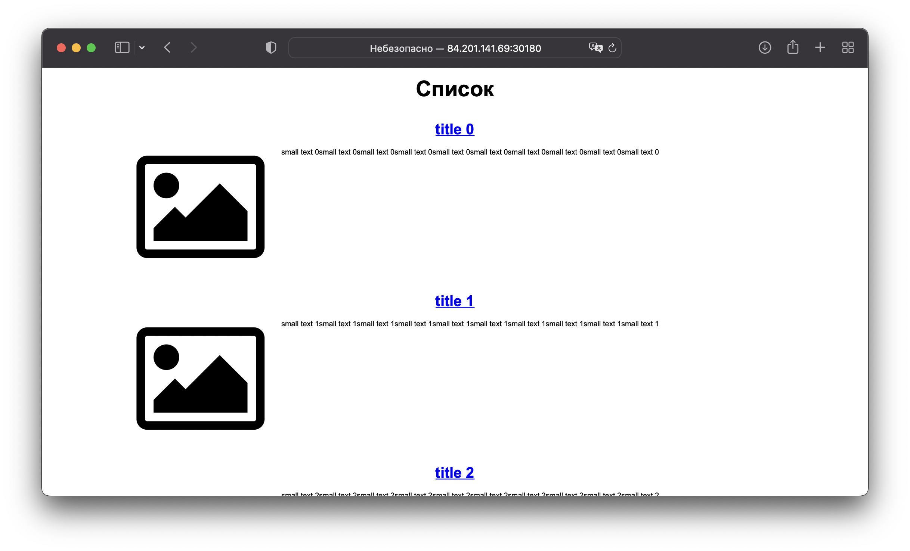
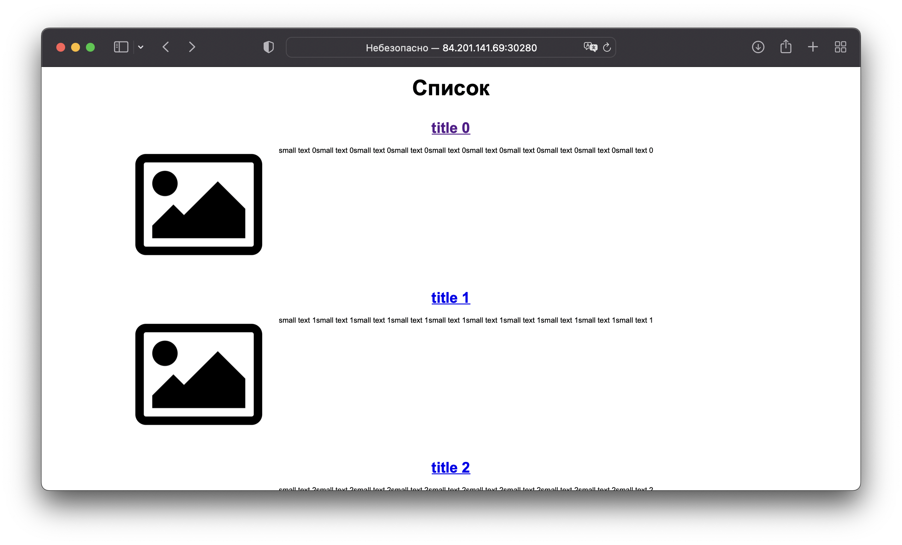

# 13.4 инструменты для упрощения написания конфигурационных файлов. Helm и Jsonnet  

## Задание 1: подготовить helm чарт для приложения  

Упакуем приложение из предыдущих занятий в чарт для деплоя в разные окружения.  
Исходники чарта [здесь](charts/my-app)  
Проверка темплейтов:  
```shell
% helm lint my-app 
==> Linting my-app
[INFO] Chart.yaml: icon is recommended

1 chart(s) linted, 0 chart(s) failed

% helm template my-app
---
# Source: my-app/templates/backend-svc.yaml
apiVersion: v1
kind: Service
metadata:
  name: backend
  namespace: app1
spec:
  ports:
    - name: web9000
      port: 9000
      nodePort: 30081
  selector:
    app: backend
  type: NodePort
---
# Source: my-app/templates/db-svc.yaml
apiVersion: v1
kind: Service
metadata:
  name: db
  namespace: app1
spec:
  ports:
    - name: pgport
      port: 5432
  selector:
    app: db
---
# Source: my-app/templates/frontend-svc.yaml
apiVersion: v1
kind: Service
metadata:
  name: frontend
  namespace: app1
spec:
  ports:
    - name: web8000
      port: 8000
      targetPort: 80
      nodePort: 30080
  selector:
    app: frontend
  type: NodePort
---
# Source: my-app/templates/backend-deploy.yaml
apiVersion: apps/v1
kind: Deployment
metadata:
  labels:
    app: backend
  name: backend
  namespace: app1
spec:
  replicas: 1
  selector:
    matchLabels:
      app: backend
  template:
    metadata:
      labels:
        app: backend
    spec:
      containers:
        - image: "belas80/backend:latest"
          imagePullPolicy: IfNotPresent
          name: backend
          ports:
            - containerPort: 9000
          resources:
            limits:
              cpu: 200m
              memory: 256Mi
            requests:
              cpu: 100m
              memory: 128Mi
      terminationGracePeriodSeconds: 30
---
# Source: my-app/templates/frontend-deploy.yaml
apiVersion: apps/v1
kind: Deployment
metadata:
  name: frontend
  labels:
    app: frontend
  namespace: app1
spec:
  replicas: 1
  selector:
    matchLabels:
      app: frontend
  template:
    metadata:
      labels:
        app: frontend
    spec:
      containers:
        - name: frontend
          image: "belas80/frontend:latest"
          imagePullPolicy: IfNotPresent
          ports:
            - name: http
              containerPort: 80
              protocol: TCP
          resources:
            limits:
              cpu: 200m
              memory: 256Mi
            requests:
              cpu: 100m
              memory: 128Mi
---
# Source: my-app/templates/db-sts.yaml
apiVersion: apps/v1
kind: StatefulSet
metadata:
  labels:
    app: db
  name: db
  namespace: app1
spec:
  serviceName: db
  replicas: 1
  selector:
    matchLabels:
      app: db
  template:
    metadata:
      labels:
        app: db
    spec:
      containers:
        - image: "postgres:13-alpine"
          imagePullPolicy: IfNotPresent
          name: db
          ports:
            - containerPort: 5432
          env:
            - name: POSTGRES_PASSWORD
              value: postgres
            - name: POSTGRES_USER
              value: postgres
            - name: POSTGRES_DB
              value: news
          resources:
            limits:
              cpu: 400m
              memory: 512Mi
            requests:
              cpu: 200m
              memory: 256Mi
      terminationGracePeriodSeconds: 30
```

## Задание 2: запустить 2 версии в разных неймспейсах  

Подготовив чарт, необходимо его проверить. Попробуйте запустить несколько копий приложения:

* одну версию в namespace=app1;
  ```shell
  # проверка текущего состояния
  % helm list -A
  NAME            NAMESPACE       REVISION        UPDATED                                 STATUS          CHART                           APP VERSION
  nfs-server      prod            1               2022-06-29 23:37:01.452847 +0500 +05    deployed        nfs-server-provisioner-1.1.3    2.3.0 
  
  # установка в namespace app1
  % helm install my-app my-app --namespace app1
  NAME: my-app
  LAST DEPLOYED: Tue Jul 12 03:13:38 2022
  NAMESPACE: app1
  STATUS: deployed
  REVISION: 1
  TEST SUITE: None
  NOTES:
  ---------------------------------------------------------
  
  Content of NOTES.txt appears after deploy.
  Deployed to app1 namespace.
  
  ---------------------------------------------------------
  
  # проверка
  % helm list -A
  NAME            NAMESPACE       REVISION        UPDATED                                 STATUS          CHART                           APP VERSION
  my-app          app1            1               2022-07-12 03:13:38.201287 +0500 +05    deployed        my-app-0.1.2                    1.16.1     
  nfs-server      prod            1               2022-06-29 23:37:01.452847 +0500 +05    deployed        nfs-server-provisioner-1.1.3    2.3.0
  
  % kubectl get deploy,sts,svc -n app1
  NAME                       READY   UP-TO-DATE   AVAILABLE   AGE
  deployment.apps/backend    1/1     1            1           3m52s
  deployment.apps/frontend   1/1     1            1           3m52s
  
  NAME                  READY   AGE
  statefulset.apps/db   1/1     3m52s
  
  NAME               TYPE        CLUSTER-IP      EXTERNAL-IP   PORT(S)          AGE
  service/backend    NodePort    10.233.62.248   <none>        9000:30081/TCP   3m52s
  service/db         ClusterIP   10.233.4.96     <none>        5432/TCP         3m52s
  service/frontend   NodePort    10.233.47.162   <none>        8000:30080/TCP   3m52s
  ```
* вторую версию в том же неймспейсе;  
  Для запуска в том же неймспейсе, необходимо переопределить имена ресурсов и nodePort. Сделаем это с помощью файла [new-values.yaml](charts/my-app/new-values.yaml).
  ```yaml
  frontend:
    appName: frontend2
    nodePort: 30180
  
  backend:
    appName: backend2
    nodePort: 30181
  
  db:
    appName: db2  
  ```
  Запуск  
  ```shell
  # установка
  % helm install my-app2 my-app --namespace app1 -f my-app/new-values.yaml
  NAME: my-app2
  LAST DEPLOYED: Tue Jul 12 03:28:42 2022
  NAMESPACE: app1
  STATUS: deployed
  REVISION: 1
  TEST SUITE: None
  NOTES:
  ---------------------------------------------------------
  
  Content of NOTES.txt appears after deploy.
  Deployed to app1 namespace.
  
  ---------------------------------------------------------
  
  # проверка
  % helm list -A
  NAME            NAMESPACE       REVISION        UPDATED                                 STATUS          CHART                           APP VERSION
  my-app          app1            1               2022-07-12 03:13:38.201287 +0500 +05    deployed        my-app-0.1.2                    1.16.1     
  my-app2         app1            1               2022-07-12 03:28:42.501353 +0500 +05    deployed        my-app-0.1.2                    1.16.1     
  nfs-server      prod            1               2022-06-29 23:37:01.452847 +0500 +05    deployed        nfs-server-provisioner-1.1.3    2.3.0
  
  % kubectl get deploy,sts,svc -n app1
  NAME                        READY   UP-TO-DATE   AVAILABLE   AGE
  deployment.apps/backend     1/1     1            1           19m
  deployment.apps/backend2    1/1     1            1           4m30s
  deployment.apps/frontend    1/1     1            1           19m
  deployment.apps/frontend2   1/1     1            1           4m30s
  
  NAME                   READY   AGE
  statefulset.apps/db    1/1     19m
  statefulset.apps/db2   1/1     4m30s
  
  NAME                TYPE        CLUSTER-IP      EXTERNAL-IP   PORT(S)          AGE
  service/backend     NodePort    10.233.62.248   <none>        9000:30081/TCP   19m
  service/backend2    NodePort    10.233.60.249   <none>        9000:30181/TCP   4m30s
  service/db          ClusterIP   10.233.4.96     <none>        5432/TCP         19m
  service/db2         ClusterIP   10.233.40.171   <none>        5432/TCP         4m30s
  service/frontend    NodePort    10.233.47.162   <none>        8000:30080/TCP   19m
  service/frontend2   NodePort    10.233.20.46    <none>        8000:30180/TCP   4m30s
  ```
* третью версию в namespace=app2.  
  Для запуска в другом неймспейсе, достаточно переопределить порты nodePort, ну и сам неймспейс. Сделаем это с помощью флага `--set`. А еще поменяем версию чарта и приложения.  
  ```shell
  # установка
  % helm install my-app3 my-app --set frontend.nodePort=30280,backend.nodePort=30281,namespace=app2 --namespace app2
  NAME: my-app3
  LAST DEPLOYED: Tue Jul 12 03:39:40 2022
  NAMESPACE: app2
  STATUS: deployed
  REVISION: 1
  TEST SUITE: None
  NOTES:
  ---------------------------------------------------------
  
  Content of NOTES.txt appears after deploy.
  Deployed to app2 namespace.
  
  ---------------------------------------------------------
  
  # проверка
  % helm ls -A  
  NAME            NAMESPACE       REVISION        UPDATED                                 STATUS          CHART                           APP VERSION
  my-app          app1            1               2022-07-12 03:13:38.201287 +0500 +05    deployed        my-app-0.1.2                    1.16.1     
  my-app2         app1            1               2022-07-12 03:28:42.501353 +0500 +05    deployed        my-app-0.1.2                    1.16.1     
  my-app3         app2            1               2022-07-12 03:39:40.157473 +0500 +05    deployed        my-app-0.1.3                    1.17.2     
  nfs-server      prod            1               2022-06-29 23:37:01.452847 +0500 +05    deployed        nfs-server-provisioner-1.1.3    2.3.0
  
  % kubectl get deploy,sts,svc -n app2                                                                              
  NAME                       READY   UP-TO-DATE   AVAILABLE   AGE
  deployment.apps/backend    1/1     1            1           100s
  deployment.apps/frontend   1/1     1            1           100s
  
  NAME                  READY   AGE
  statefulset.apps/db   1/1     100s
  
  NAME               TYPE        CLUSTER-IP     EXTERNAL-IP   PORT(S)          AGE
  service/backend    NodePort    10.233.57.61   <none>        9000:30281/TCP   100s
  service/db         ClusterIP   10.233.35.18   <none>        5432/TCP         100s
  service/frontend   NodePort    10.233.51.57   <none>        8000:30280/TCP   100s
  ```
  
Все запустилось :), можно проверить через браузер на разных портах.  



